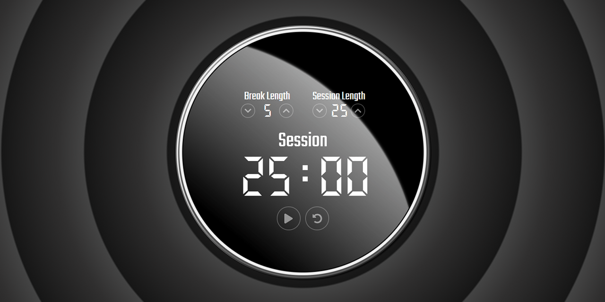

# Catlogic Pomodoro Timer
**Self-study React Project**

### About

A simple 25+5 (pomodoro) timer made on React.
* Current live version at https://cat-street.github.io/pomodoro-timer-react/

### Under the hood

* React, JavaScript ES6 syntax, CSS3 + semantic HTML5
* Functional components
* React hooks: useState, useCallback, useRef
* Ability to set session and break length, reset function
* Designed by pure CSS.
* HTML/CSS naming by BEM.
